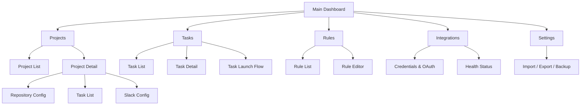
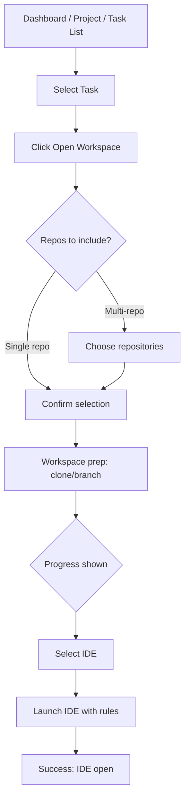
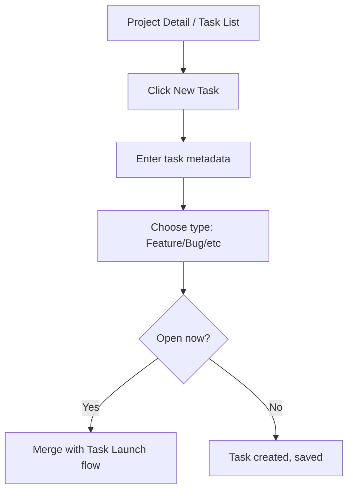
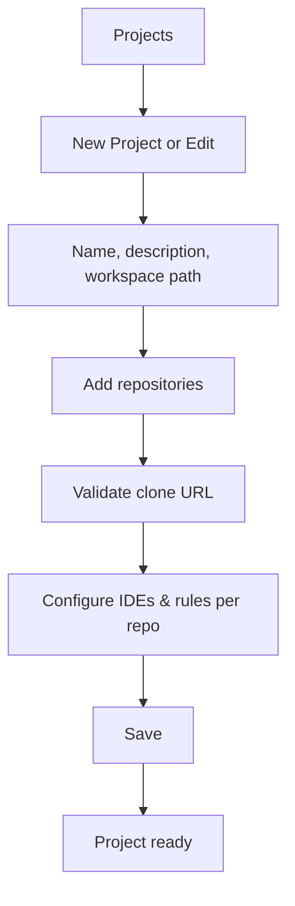

# AiTask UI/UX Specification

This document defines the user experience goals, information architecture, user flows, and visual design specifications for AiTask's user interface. It serves as the foundation for visual design and frontend development, ensuring a cohesive and user-centered experience.

## Overall UX Goals & Principles

### Target User Personas

- **Power User / Full-Stack Developer:** Technical professionals managing multiple microservices and repositories; need advanced configuration, multi-repository visibility, and efficiency in task switching.
- **Team Lead:** Coordinating development across repositories; need dashboard metrics, recent activity, and oversight capabilities.
- **Casual / Solo Developer:** Occasional users who prioritize ease of use and clear guidance for the core task-to-workspace flow.
- **Administrator:** System managers who need control over projects, repositories, rules, integrations, and credentials; require safe destructive-action patterns.

### Usability Goals

- **Ease of learning:** New users can complete core tasks (select project → open task workspace) within 5 minutes.
- **Efficiency of use:** Power users can complete frequent tasks with minimal clicks once configured.
- **Error prevention:** Clear validation and confirmation for destructive actions (workspace cleanup, archival, credential replacement).
- **Memorability:** Infrequent users can return without relearning the flow.
- **Responsiveness:** Visible progress states for long-running operations (clone, branch creation, health checks, IDE launch).
- **Accessibility:** Desktop keyboard navigation, visible focus states, readable contrast, semantic labeling (WCAG AA–equivalent).

### Design Principles

1. **Clarity over cleverness** — Prioritize clear communication and predictable flows over aesthetic innovation.
2. **Progressive disclosure** — Show essential context first; reveal advanced configuration when needed.
3. **Consistent patterns** — Use familiar master-detail, inline status, and confirmation patterns throughout.
4. **Immediate feedback** — Every action should have a clear, immediate response, especially long-running ones.
5. **Accessible by default** — Design for keyboard, screen readers, and contrast from the start.
6. **Developer control center feel** — Balance information density with speed; prioritize fast orientation and low-friction task startup.

### Change Log

| Date | Version | Description | Author |
|------|---------|-------------|--------|
| 2026-03-11 | 0.1 | Initial front-end spec draft | Sally (UX Expert) |
| 2026-03-11 | 0.2 | Completed full spec: IA, flows, wireframes, components, branding, accessibility, responsiveness, animation, performance | Sally (UX Expert) |
| 2026-03-12 | 0.3 | Linked the approved HTML mockup set for development handoff and page-level implementation reference | Sally (UX Expert) |

---

## Information Architecture (IA)

### Site Map / Screen Inventory

### Navigation Structure

**Primary Navigation:** Top-level tabs or sidebar for Dashboard, Projects, Tasks, Rules, Integrations, Settings. Dashboard-first entry point.

**Secondary Navigation:** Context-specific tabs within each area (e.g., Project Detail → Repositories, Tasks, Slack). Master-detail pattern with list on left, detail on right where applicable.

**Breadcrumb Strategy:** Light touch—primary structure is 1–2 levels deep. Breadcrumbs optional for deep flows (e.g., Project → Repository → IDE Config).

---

## User Flows

### Flow 1: Task Launch (Primary MVP Flow)

**User Goal:** Open a task's development workspace in the configured IDE with rules applied.

**Entry Points:** Dashboard (recent tasks), Project Detail (task list), Tasks (global task list).

**Success Criteria:** User has IDE open with task-specific workspace and branch; rules applied.

**Edge Cases & Error Handling:**
- Clone fails → Show actionable error (URL, auth, network); offer retry.
- Branch creation fails → Show conflict; allow manual branch choice or retry.
- IDE not configured → Prompt to configure IDE or use system default.
- Credentials missing/invalid → Direct user to Integrations for setup.

**Notes:** Flow should complete within 60 seconds for typical shallow-clone setup (NFR2).

---

### Flow 2: Create and Start New Task

**User Goal:** Create a task and optionally open its workspace immediately.

**Entry Points:** Project Detail (Add Task), Task List (New Task).

**Success Criteria:** Task created with metadata; workspace open if user chose "Open Now."

**Edge Cases & Error Handling:**
- Invalid branch template → Validate and show error before creation.
- Workspace path invalid → Check path and permissions; show clear error.

---

### Flow 3: Project and Repository Setup

**User Goal:** Configure a project with repositories and IDE/rule preferences.

**Entry Points:** Projects (New Project), Project Detail (Edit).

**Success Criteria:** Project saved with repos, workspace path, branch template, IDE/rule config.

**Edge Cases & Error Handling:**
- Invalid clone URL → Validate format and provider; show suggestions.
- Duplicate repo in project → Block or warn.
- Workspace path not writable → Check access and show error.

---

## Wireframes & Mockups

### Primary Design Files

**Current Design Source:** HTML mockup set in [`docs/mockups/`](./mockups/index.html). **Location:** [`docs/mockups/index.html`](./mockups/index.html). **Handoff:** Until a Figma or equivalent file exists, these HTML mockups are the canonical visual reference for layout, hierarchy, and page composition during development.

### Development Handoff Rule

- Use this front-end specification as the source of truth for behavior, flows, accessibility, and component intent.
- Use the HTML mockups in [`docs/mockups/`](./mockups/index.html) as the source of truth for page layout, visual hierarchy, and information grouping.
- If a mockup and story text appear to conflict, preserve the story acceptance criteria and user flow, then update the story or spec to remove ambiguity before implementation.

### Mockup Reference Map

| Area | Primary Mockup |
|------|----------------|
| Overview / gallery | [`docs/mockups/index.html`](./mockups/index.html) |
| Main Dashboard | [`docs/mockups/dashboard.html`](./mockups/dashboard.html) |
| Projects list / creation | [`docs/mockups/projects.html`](./mockups/projects.html) |
| Project detail / repository + task + Slack tabs | [`docs/mockups/project-detail.html`](./mockups/project-detail.html) |
| Tasks list and task detail pane | [`docs/mockups/tasks.html`](./mockups/tasks.html) |
| Task Launch Flow | [`docs/mockups/task-launch.html`](./mockups/task-launch.html) |
| Rule Management | [`docs/mockups/rules.html`](./mockups/rules.html) |
| Integrations & Health | [`docs/mockups/integrations.html`](./mockups/integrations.html) |
| Settings / Import / Export / Backup | [`docs/mockups/settings.html`](./mockups/settings.html) |

### Key Screen Layouts

#### 1. Main Dashboard

**Purpose:** Entry point—recent tasks, project overview, recent activity, system health.

**Key Elements:**
- Hero area: Quick Open for recent/favorite tasks
- Project cards or list with task counts
- Recent activity feed (workspace opens, status changes)
- System health indicators (DB, Git, APIs)

**Interaction Notes:** One-click open for recent tasks; project cards navigate to Project Detail.

**Design File Reference:** [`docs/mockups/dashboard.html`](./mockups/dashboard.html)

---

#### 2. Project Detail (Master-Detail)

**Purpose:** Manage a project's repositories, tasks, and Slack config.

**Key Elements:**
- Left: Repo list; tabs for Repositories, Tasks, Slack
- Right: Selected repo config or task list
- Header: Project name, workspace path, branch template

**Interaction Notes:** Tab switching; inline edit for repo config; add task / Open Workspace actions.

**Design File Reference:** [`docs/mockups/project-detail.html`](./mockups/project-detail.html)

---

#### 3. Task Launch Flow (Modal or Stepper)

**Purpose:** Guided flow for repo selection → workspace prep → IDE choice → launch.

**Key Elements:**
- Step indicator: Repo selection → Prep (clone/branch) → IDE choice → Launch
- Progress indicator for clone, branch, rules; status per step
- Confirm button before launch

**Interaction Notes:** Next/Back; Cancel at any step; Retry on failure.

**Design File Reference:** [`docs/mockups/task-launch.html`](./mockups/task-launch.html)

---

#### 4. Rule Management

**Purpose:** Create/edit reusable rule sets for IDE and AI tools.

**Key Elements:**
- Rule list with name, scope, attachment count
- Rule editor (content area, syntax highlighting optional)
- Attach/detach to project/repo

**Interaction Notes:** Inline or side-panel editor; validate before save.

**Design File Reference:** [`docs/mockups/rules.html`](./mockups/rules.html)

---

#### 5. Integrations & Health

**Purpose:** Manage credentials (HTTPS, OAuth) and view connection status.

**Key Elements:**
- Credential list (provider, status)
- OAuth connect buttons per provider
- Health panel (DB, Git, Slack, API status)

**Interaction Notes:** Connect/disconnect; secure display (masked credentials, no plaintext).

**Design File Reference:** [`docs/mockups/integrations.html`](./mockups/integrations.html)

#### 6. Projects List / Creation

**Purpose:** Browse, create, and edit project shells before moving into detailed repository configuration.

**Key Elements:**
- Search and filter bar for project discovery
- Project cards/list with health and repo count summary
- Project creation/edit form with workspace path and branch template
- Inline repository summary before save

**Interaction Notes:** The list screen should keep discovery lightweight; heavy repo details move into Project Detail.

**Design File Reference:** [`docs/mockups/projects.html`](./mockups/projects.html)

---

#### 7. Tasks List / Detail

**Purpose:** Browse the global task queue, inspect task details, and open the task launch flow.

**Key Elements:**
- Persistent filter rail
- Task list with status, project, and recency metadata
- Task detail side pane with launch readiness
- Primary CTA to open workspace

**Interaction Notes:** Treat task detail as a selected state of the task list unless a later implementation requires a dedicated route.

**Design File Reference:** [`docs/mockups/tasks.html`](./mockups/tasks.html)

---

#### 8. Settings / Import / Export / Backup

**Purpose:** Configure application-wide preferences, backup behavior, and data portability workflows.

**Key Elements:**
- Backup and restore controls
- Import/export utilities
- Environment defaults
- Destructive-action confirmation patterns

**Interaction Notes:** High-risk operations should favor clarity and confirmation over density.

**Design File Reference:** [`docs/mockups/settings.html`](./mockups/settings.html)

---

#### 9. Slack Channel Configuration View

**Purpose:** Configure per-project Slack channel routing and notification delivery behavior.

**Key Elements:**
- Channel selector or connected workspace summary
- Notification toggle and delivery state
- Test message action
- Safe disconnect or reconnect affordances

**Interaction Notes:** Treat this as a secondary tab within Project Detail rather than a standalone primary route.

**Design File Reference:** [`docs/mockups/project-detail.html`](./mockups/project-detail.html)

---

#### 10. Import / Export / Backup Restore View

**Purpose:** Support portable export, archive import, scheduled backup, and local restore workflows.

**Key Elements:**
- Manual import/export actions
- Backup schedule and last-run status
- Restore entry point with validation messaging
- Destructive confirmation for risky restore or cleanup operations

**Interaction Notes:** This view is represented inside the Settings screen and should not require a separate navigation destination in the MVP.

**Design File Reference:** [`docs/mockups/settings.html`](./mockups/settings.html)

---

## Component Library / Design System

### Design System Approach

**Approach:** Use **Compose Material 3** (Material Design 3) as the foundation. Leverage built-in theming (colors, typography, shapes) and standard components (buttons, text fields, cards, lists), with customization where needed to achieve a developer-tool aesthetic.

**Rationale:** Material 3 aligns with Kotlin/Compose desktop; provides consistent, accessible components; supports light/dark themes. Customization keeps the interface professional and information-dense rather than decorative.

### Core Components

| Component | Purpose | Variants | Key States | Usage |
|-----------|---------|----------|------------|-------|
| **Primary Action Button** | Start main actions (Open Workspace, Launch IDE) | Primary (filled), Secondary (outlined) | Default, Hover, Focused, Pressed, Disabled, Loading | One per screen for primary CTA |
| **Status Indicator** | Show connection health, task status | Ready / Syncing / Warning / Failed / Completed | Idle, In-progress (with optional progress) | System health, task status, repo sync |
| **Master-Detail List** | Projects, repos, tasks list with detail pane | Single-select, Multi-select (repo inclusion) | Empty, Loading, Selected, Error | Project list, repo list, task list |
| **Stepper / Progress** | Task launch flow steps | Linear stepper with status | Pending, Active, Completed, Failed | Task launch modal/wizard |
| **Form Fields** | Project name, path, clone URL input | Text, Path picker, URL | Default, Focused, Error, Disabled | Project/edit forms, repo config |
| **Confirmation Dialog** | Destructive action confirmation | Standard, Destructive (warn color) | Open, Loading (async) | Workspace cleanup, archival, credential removal |
| **Card** | Project/task summary grouping | Default, Elevated, Outlined | Default, Hover, Selected | Dashboard project cards, task summaries |
| **Tab Bar** | Primary/secondary navigation | Horizontal tabs | Default, Selected | Nav: Dashboard, Projects, Tasks, Rules; Context: Repos, Tasks, Slack |

---

## Branding & Style Guide

### Visual Identity

**Brand Guidelines:** None defined. Interface aims for a professional developer-tool aesthetic—structured layouts, high information clarity, restrained visual decoration, and strong visual distinction between operational states (ready, syncing, warning, failed, completed).

### Color Palette

| Color Type | Hex Code | Usage |
|------------|----------|-------|
| Primary | `#1976D2` | Primary actions, links, selected states |
| Secondary | `#424242` | Secondary UI, supporting text |
| Accent | `#00BCD4` | Highlights, informational emphasis |
| Success | `#4CAF50` | Positive feedback, confirmations, completed |
| Warning | `#FF9800` | Cautions, in-progress, syncing |
| Error | `#F44336` | Errors, destructive actions |
| Neutral | `#212121` / `#757575` / `#BDBDBD` | Text, borders, backgrounds |

### Typography

**Font Families:**
- **Primary:** Roboto (or system sans-serif fallback)
- **Secondary:** Roboto
- **Monospace:** JetBrains Mono or Roboto Mono (paths, URLs, rule content)

**Type Scale:**

| Element | Size | Weight | Line Height | Usage |
|---------|------|--------|-------------|-------|
| H1 | 24sp | Medium | 32sp | Screen titles |
| H2 | 20sp | Medium | 28sp | Section headers |
| H3 | 16sp | Medium | 24sp | Subsection headers |
| Body | 14sp | Regular | 20sp | Body text |
| Small | 12sp | Regular | 16sp | Captions, metadata |

### Iconography

**Icon Library:** Material Icons (or Material Symbols) aligned with Compose Material 3.

**Usage Guidelines:** Use standard icons for common actions (play, folder, settings, etc.). Maintain visual consistency; ensure adequate size for touch targets (≥24dp).

### Spacing & Layout

**Grid System:** 8dp base unit. Align to 4dp, 8dp, 16dp, 24dp, 32dp for padding and gaps.

**Spacing Scale:** 4dp, 8dp, 12dp, 16dp, 24dp, 32dp, 48dp.

---

## Accessibility Requirements

### Compliance Target

**Standard:** WCAG 2.1 Level AA–equivalent for desktop. Focus on keyboard navigation, visible focus states, readable contrast, semantic labeling, and status messaging for long-running or failed operations.

### Key Requirements

**Visual:**
- **Color contrast ratios:** ≥4.5:1 for normal text, ≥3:1 for large text.
- **Focus indicators:** Visible focus outline on all interactive elements (never rely on color alone).
- **Text sizing:** Support system font scaling; body text ≥14sp.

**Interaction:**
- **Keyboard navigation:** Full keyboard support—Tab, Shift+Tab, Enter, Space, Escape. Logical tab order.
- **Screen reader support:** Semantic labels (ARIA where applicable), roles for lists/buttons/dialogs; live region announcements for status and errors.
- **Touch targets:** ≥24×24dp for clickable areas (desktop).

**Content:**
- **Alternative text:** Meaningful labels for icons and status indicators.
- **Heading structure:** Logical hierarchy (H1 → H2 → H3).
- **Form labels:** Visible or programmatically associated; clear error messages.

### Testing Strategy

- Automated checks for contrast, focus visibility, basic semantics (where tooling exists for Compose).
- Manual keyboard testing for core flows (dashboard, task launch, project setup).
- Screen reader testing: NVDA (Windows), VoiceOver (macOS) for critical paths.
- Verify status announcements for long-running operations (clone, branch, launch).

---

## Responsiveness Strategy

**Context:** AiTask is desktop-only (Windows, macOS, Linux). Responsiveness focuses on window resizing, not mobile breakpoints.

### Breakpoints (Window Width)

| Breakpoint | Min Width | Max Width | Target Devices |
|------------|-----------|-----------|----------------|
| Compact | 640px | 959px | Small windows, narrow laptop screens |
| Medium | 960px | 1279px | Standard laptop |
| Expanded | 1280px | 1919px | Large desktop |
| Wide | 1920px | — | Ultrawide, multi-monitor |

### Adaptation Patterns

**Layout Changes:**
- Compact: Collapse sidebars where possible; master-detail can stack or use drawer.
- Medium+: Sidebar + detail visible; dashboard 2-column grid.
- Expanded/Wide: Use horizontal space for additional columns (activity feed, metrics).

**Navigation Changes:**
- Compact: Primary nav as top tabs or hamburger + drawer.
- Medium+: Persistent sidebar or top tabs.

**Content Priority:**
- Compact: Prioritize primary content (e.g., task list); secondary info in expandable panels.
- Medium+: Show dashboard, project metadata, activity side-by-side.

**Interaction Changes:**
- Primary actions remain visible and reachable at all widths.
- Avoid horizontal scroll for core flows.
- Modals/dialogs scale with window; minimum usable width ~400px.

---

## Animation & Micro-interactions

### Motion Principles

- **Purposeful motion** — Animation for feedback, not decoration.
- **Short and subtle** — Durations 150–300ms for micro-interactions; avoid long or distracting motion.
- **Respect preferences** — Honor system "reduce motion" where supported.
- **Performance-aware** — Prefer opacity/transform; avoid layout thrashing during animation.

### Key Animations

| Animation | Purpose | Duration | Easing | Notes |
|-----------|---------|----------|--------|-------|
| **Button press** | Press feedback | 100–150ms | EaseOut | Subtle scale or ripple |
| **Status change** | State transition (ready→syncing→done) | 200ms | EaseInOut | Smooth indicator change |
| **Progress indicator** | Long-running ops (clone, branch) | Indeterminate | — | Spinner or progress bar |
| **List item selection** | Master-detail selection | 150ms | EaseOut | Highlight/background transition |
| **Modal open/close** | Dialog entry/exit | 200ms | EaseOut | Fade + slight scale |
| **Tab switch** | Content transition | 150ms | EaseInOut | Fade or slide |
| **Error shake** | Validation failure | 300ms | — | Horizontal shake to draw attention |

---

## Performance Considerations

### Performance Goals

- **Application startup:** App window ready within 3 seconds of launch.
- **Interaction response:** UI interactions (clicks, tab switches) respond within 200ms.
- **Task launch:** Workspace open within 60 seconds for typical shallow-clone setup (NFR2).
- **Animation FPS:** Maintain 60fps for micro-interactions; avoid jank during list scroll and transitions.

### Design Strategies

- **Async + progress:** Long-running operations (clone, branch, IDE launch) run off the main thread; show visible progress and allow cancellation.
- **Lazy loading:** Defer loading of non-critical data (activity feed, metrics) until visible or after initial render.
- **List virtualization:** Use virtualized lists for large project/task lists to keep scroll performance smooth.
- **State feedback:** Always show loading or in-progress state so the UI feels responsive even when work is async.

---

## Next Steps

### Immediate Actions

1. Review this specification with stakeholders (Product, Architect, Dev).
2. Establish design tool (Figma, Sketch, or equivalent) and create high-fidelity mockups for key screens.
3. Hand off to Architect for front-end architecture (technical component specs, state management, Compose structure).
4. Resolve open questions: exact breakpoint values, dark/light theme defaults, rule editor syntax highlighting.

### Design Handoff Checklist

- [ ] All user flows documented
- [ ] Component inventory complete
- [ ] Accessibility requirements defined
- [ ] Responsive strategy clear
- [ ] Brand guidelines incorporated (or minimal style guide established)
- [ ] Performance goals established

---

## Checklist Results

*To be populated when a UI/UX checklist is run against this document.*
